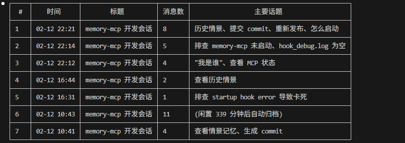

# Memory MCP Service

[](https://pypi.org/project/chenxiaofie-memory-mcp/)
[](https://pypi.org/project/chenxiaofie-memory-mcp/)
[](https://opensource.org/licenses/MIT)

[English](README.md) | [中文](README_zh.md)

Claude Code 的持久化记忆 MCP 服务。自动保存对话内容，跨会话检索相关历史。

**解决什么问题：** 每次新会话，Claude 都会"失忆"——不记得之前的决策、偏好和讨论。这个服务让 Claude 自动记住上下文，下次对话时自动回忆相关历史。



## 快速开始

### 前置条件

安装 [uv](https://docs.astral.sh/uv/getting-started/installation/)（Python 包运行工具）：

```bash
# Windows
powershell -c "irm https://astral.sh/uv/install.ps1 | iex"

# Mac/Linux
curl -LsSf https://astral.sh/uv/install.sh | sh
```

> 需要 Python 3.10 - 3.13（chromadb 不兼容 Python 3.14+）。

### 1. 初始化（仅首次需要）

下载向量模型（~400MB，只需运行一次）：

```bash
uvx --from chenxiaofie-memory-mcp memory-mcp-init
```

### 2. 添加 MCP 服务到 Claude Code

```bash
claude mcp add memory-mcp -s user -- uvx --from chenxiaofie-memory-mcp memory-mcp
```

### 3. 配置 Hooks（推荐）

Hooks 实现**全自动**消息保存。不配置的话需要手动调用记忆工具。

在 `~/.claude/settings.json` 中添加：

```json
{
  "hooks": {
    "SessionStart": [{
      "matcher": ".*",
      "hooks": [{ "type": "command", "command": "uvx --from chenxiaofie-memory-mcp memory-mcp-session-start" }]
    }],
    "UserPromptSubmit": [{
      "matcher": ".*",
      "hooks": [{ "type": "command", "command": "uvx --from chenxiaofie-memory-mcp memory-mcp-auto-save" }]
    }],
    "Stop": [{
      "matcher": ".*",
      "hooks": [{ "type": "command", "command": "uvx --from chenxiaofie-memory-mcp memory-mcp-save-response" }]
    }],
    "SessionEnd": [{
      "matcher": ".*",
      "hooks": [{ "type": "command", "command": "uvx --from chenxiaofie-memory-mcp memory-mcp-session-end" }]
    }]
  }
}
```

### 4. 验证

```bash
claude mcp list
```

看到 `memory-mcp: ... - ✓ Connected` 就说明配置成功了。

搞定！开始新的 Claude Code 会话，对话会自动保存和回忆。

## 工作原理

```
会话开始 ──► 创建情景 ──► 启动监控进程（后台）
                              │
用户消息 ──► 保存消息 ──► 检索相关记忆 ──► 注入上下文
                              │
Claude 回复 ──► 保存回复      │
                              │
会话结束 ──► 关闭信号 ──► 归档情景 + 生成摘要
```

- **情景 (Episodes)**：每次对话会话是一个"情景"，结束时自动生成摘要
- **实体 (Entities)**：从对话中提取的结构化知识（决策、偏好、概念等）
- **双层存储**：用户级（跨项目共享）+ 项目级（项目隔离）
- **语义检索**：基于向量的语义搜索，自动找到相关的历史上下文

## 使用方式

### 自动模式（配置 Hooks 后）

配置好 Hooks 后一切自动运行。Claude 会自动看到过去会话中的相关历史作为上下文。

### 手动模式

也可以在 Claude Code 中直接调用记忆工具：

```
# 开始新情景
memory_start_episode("登录功能开发", ["auth"])

# 记录决策
memory_add_entity("Decision", "采用 JWT + Redis 方案", "考虑分布式部署")

# 检索历史
memory_recall("登录方案")

# 关闭情景
memory_close_episode("完成登录功能开发")
```

## Hooks 说明

| Hook | 作用 | 耗时 |
|------|-----|------|
| SessionStart | 创建新情景 | ~50ms |
| UserPromptSubmit | 保存用户消息 + 检索相关记忆 | ~1-2s |
| Stop | 保存 Claude 回复 | ~1s |
| SessionEnd | 发送情景关闭信号 | ~50ms |

## 工具列表

| 工具 | 说明 |
|------|-----|
| `memory_start_episode` | 开始新情景 |
| `memory_close_episode` | 关闭并归档当前情景 |
| `memory_get_current_episode` | 获取当前活跃情景 |
| `memory_add_entity` | 添加知识实体 |
| `memory_confirm_entity` | 确认检测到的实体候选 |
| `memory_reject_candidate` | 拒绝误检测的候选 |
| `memory_deprecate_entity` | 标记实体为过时 |
| `memory_get_pending` | 查看待确认的实体候选 |
| `memory_recall` | 语义搜索情景和实体 |
| `memory_search_by_type` | 按类型搜索实体 |
| `memory_get_episode_detail` | 获取情景详情 |
| `memory_list_episodes` | 按时间列出所有情景 |
| `memory_stats` | 获取系统统计 |
| `memory_encoder_status` | 查询向量编码器状态 |
| `memory_cache_message` | 手动缓存消息 |
| `memory_clear_cache` | 清空消息缓存 |
| `memory_cleanup_messages` | 清理旧的缓存消息 |

## 实体类型

| 类型 | 级别 | 说明 |
|------|------|-----|
| `Decision` | 项目级 | 本项目的技术决策 |
| `Architecture` | 项目级 | 架构设计 |
| `File` | 项目级 | 重要文件说明 |
| `Preference` | 用户级 | 个人偏好（跨项目共享） |
| `Concept` | 用户级 | 通用概念 |
| `Habit` | 用户级 | 工作习惯 |

## 存储位置

- **用户级**：`~/.claude-memory/`
- **项目级**：`{项目根目录}/.claude/memory/`

<details>
<summary>备选：从源码安装</summary>

如果需要从源码运行（如开发调试）：

```bash
git clone https://github.com/chenxiaofie/memory-mcp.git
cd memory-mcp
# Windows:
install.bat
# Mac/Linux:
chmod +x install.sh && ./install.sh
```

然后用 venv 的 Python 配置 MCP 服务：

```bash
# Windows:
claude mcp add memory-mcp -s user -- "C:\path\to\memory-mcp\venv310\Scripts\python.exe" -m memory_mcp.server

# Mac/Linux:
claude mcp add memory-mcp -s user -- /path/to/memory-mcp/venv310/bin/python -m memory_mcp.server
```

</details>

## 许可证

MIT License - 详见 [LICENSE](LICENSE) 文件。
